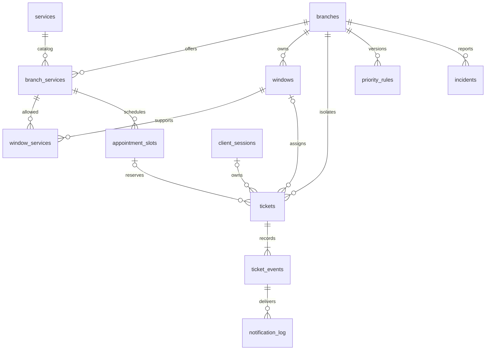

# Модель данных v1

Статус: проектное решение для первых трёх задач тимлида. SQL находится в
`docs/schema.sql`; это спецификация ограничений, а не применённая миграция.
Следующий этап: перенести её в Alembic и проверить на PostgreSQL.
Существующий frontend остаётся в `innovateQueue/`.

## ER-схема

## Таблицы и ответственность

| Таблица | Назначение и существенные ограничения |
| --- | --- |
| branches | Отделение, почтовый индекс как строка, адрес, IANA timezone, включено ли обслуживание |
| services | Общий справочник услуг; удаление заменяется отключением |
| branch_services | Доступность услуги в отделении и базовая длительность для ETA |
| windows | Номер окна уникален внутри отделения; closed/open/draining |
| window_events | Открытия/закрытия и изменения услуг окна для аудита и расчёта загрузки |
| window_services | Связь окна с услугами того же отделения |
| appointment_slots | Интервалы записи по отделению и услуге; вместимость и число занятых мест |
| client_sessions | Хеш случайного bearer-токена клиента и срок действия; без реальных аккаунтов |
| tickets | Текущее состояние талона, неизменяемый источник, номер, позиция FIFO, версия |
| ticket_events | История каждой мутации: версия талона, actor, before/after, причина, время |
| priority_rules | Неизменяемые версии правил отделения; ровно одна активная версия |
| notification_log | Durable outbox: сообщение создаётся вместе с событием; доставка после commit |
| incidents | Технические/операционные проблемы окна или талона, решение проблемы |
| idempotency_requests | Повтор команды по тому же ключу возвращает прежний результат |

## Изоляция и конкурентность

Во всех операционных связях присутствует branch_id. Составные внешние ключи
не позволяют назначить талон окну другого отделения. Это не заменяет авторизацию:
backend обязан проверять роль и доступ к отделению, включая WS-подписки.
Даже демонстрационные оператор и руководитель получают разные полномочия.

Для MVP все команды, меняющие очередь отделения, сначала блокируют его строку
`SELECT ... FROM branches WHERE id = :branch_id FOR UPDATE`.
Далее порядок блокировок: окна по id, слоты по id, талоны по id.
Это сознательная сериализация внутри одного отделения; другие отделения независимы.
Создание талона, вызов, закрытие, возврат, перенаправление, отмена и обновление
правил обязаны использовать этот протокол. Внешних вызовов внутри транзакции нет.

`call-next` под блокировкой проверяет открытое окно, отсутствие активного клиента,
доступные услуги и назначает первый подходящий талон. Два вызова одного окна
не должны назначать двух клиентов. Частичный UNIQUE-индекс дополнительно запрещает
два талона called/serving в одном окне. Не применять SKIP LOCKED для обхода общего
порядка: в этой версии строгий порядок обеспечивается блокировкой отделения.

Identity sequence выдаёт уникальный ticket_number; пропуски допустимы, сброса по дням
нет. Публичное отображение: `A-<ticket_number>`, без обрезки цифр. Номер не является
секретом или разрешением читать талон. Сериализация выдачи в отделении даёт FIFO
по queue_sequence; created_at сам по себе недостаточен при равных timestamps.

Каждая команда принимает Idempotency-Key, стабильный при сетевом повторе.
Ключ уникален в пределах actor_scope + command + branch_id; scope определяет сервер
из сессии/роли. Сохраняются хеш нормализованного запроса и ответ в той же транзакции.
Повтор с другим телом возвращает 409. Ответ создания хранит только ticket_id, а не
сырой session token. UUID и уникальный номер сами по себе не устраняют повтор заявки.

## Запись и сессия

Запись доступна только в опубликованные слоты. При создании под блокировкой слота
проверить `reserved < capacity`, увеличить reserved и создать талон одной транзакцией.
Отмена/истечение записи освобождает место ровно один раз. Уменьшать capacity ниже
reserved запрещено. Произвольный scheduled_time не создаёт новый слот.

Время хранится в timestamptz; API принимает ISO 8601 с offset, интерфейс показывает
часовой пояс отделения. Пользовательские даты и расписание переводятся в UTC.
SQL не проверяет меняющееся условие «дата в будущем»: это проверка команды.

Сессия создаётся до выдачи талона. Сырой токен возвращается один раз, хранится
в защищённой HttpOnly-cookie в production; в БД только SHA-256 от случайного токена
не менее 256 бит. Токен не передаётся в URL и не попадает в логи. После reconnect
клиент запрашивает снимок своих талонов. Для walk_in сессия необязательна.
Срок сессии должен покрывать последнюю запись + время завершения визита.

## Журнал, уведомления и аналитика

Состояние талона + ticket_events + notification_log фиксируются атомарно.
Нельзя писать журнал только HTTP-middleware после commit: падение потеряет историю.
У события сохраняются все изменённые бизнес-поля, actor_id/role, action,
rule_version для решения очереди; токены и персональные данные исключены.
Пара (ticket_id, ticket_version) уникальна. Журнал append-only для роли приложения;
права UPDATE/DELETE на него не выдаются. Миграции используют отдельную роль.

notification_log хранит event_id, channel, status, attempts, next_attempt_at,
locked_until, last_error. Уникальный (event_id, channel) защищает от повторного
создания сообщения; получатель дедуплицирует по notification id.
Гарантия доставки at-least-once, не exactly-once. Worker забирает pending/ retry
и восстанавливает processing с истёкшим lease после перезапуска. Недоступность
адаптера не откатывает обслуживание. Конкретный retry-код реализует Infra.

Ожидание = сумма waiting-интервалов после eligible_at; время до активации записи
не считается ожиданием. Время обслуживания = сумма serving-интервалов по окнам,
загрузка = serving / открытое время окна за период. Открытые интервалы восстанавливаются
по window_events, включая draining до фактического closed.
Число обслуженных = уникальные tickets, завершённые в период; повторные вызовы
не увеличивают его. Текущие ожидания показываются отдельно от завершённых.

## Что ещё должно быть проверено

SQL-ограничения не реализуют переходы состояний, авторизацию, полноту event log
или проверку открытого окна. Это обязанности команд backend и интеграционных тестов.
Нужны реальные проверки гонок create/create, call/call, call/close, cancel/call,
переполнения слота, изоляции отделений и восстановления после restart.

Основание для ограничений: [PostgreSQL constraints](https://www.postgresql.org/docs/current/ddl-constraints.html)
и [row locks](https://www.postgresql.org/docs/current/explicit-locking.html).
